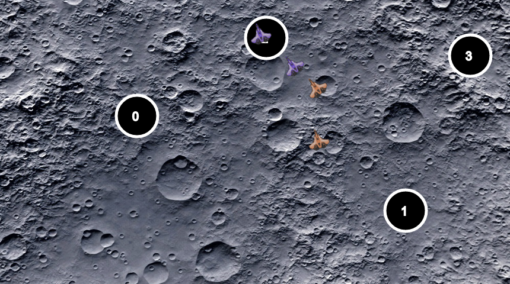

# Run

Optimized version:

    sbt "csbJS/fullOptJS"
    firefox ./csb/js/target/scala-2.12/classes/index-opt.html

Development version:

    sbt "csbJS/fastOptJS"
    firefox ./csb/js/target/scala-2.12/classes/index-dev.html

# Test

    sbt "csbJVM/testQuick"

# Learn

    sbt "csbNative/runMain sim.Simulation"

# Export

    sbt "csbJVM/runMain csb.bundle.BundlerMain csb/shared/src/main/scala/Player.scala"
    mv target/Player.scala .
    sbt scalafmt

# Resources

    - https://www.scala-js.org/api/scalajs-dom/0.9.0/index.html
    - https://www.w3.org/TR/DOM-Level-3-Events
    - http://scala-js.github.io/scala-js-dom/
